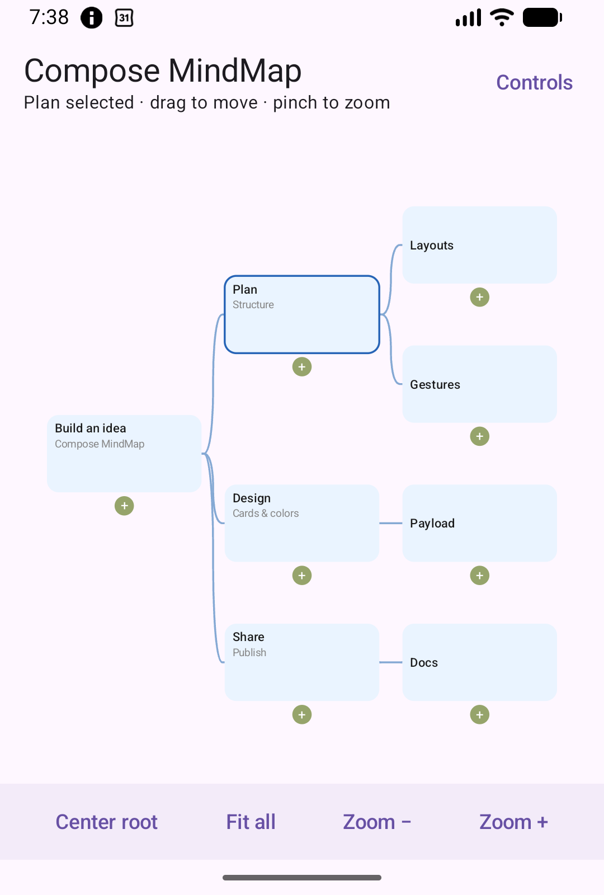
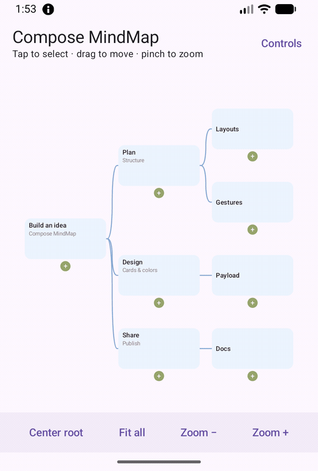
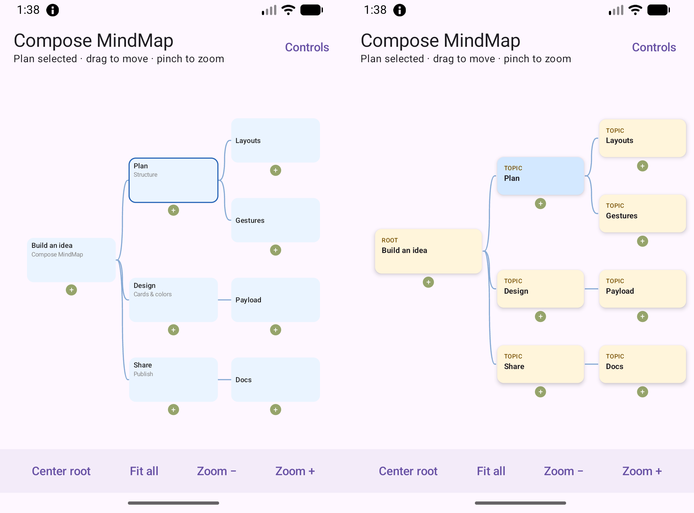
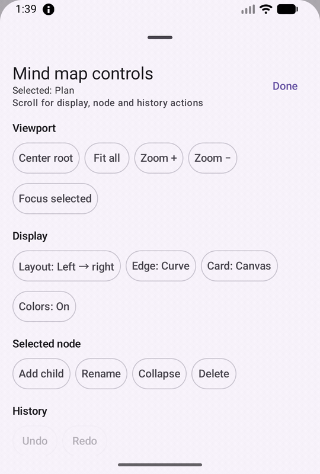
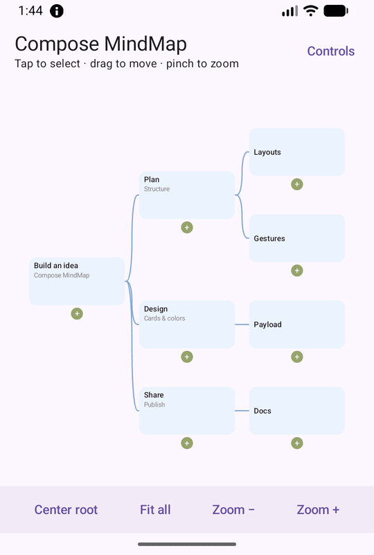

# Compose MindMap

An Android Jetpack Compose library for interactive, editable **tree-shaped mind maps**.

Start with plain `MindMapNode` data, then customize layout, edges, cards, editing, and viewport behavior without coupling your app to one fixed mind-map UI.

[한국어](docs/README.ko.md)



---

## Features at a glance

- **Tree layouts** — left-to-right and top-down
- **Edge renderers** — curved, straight, and elbow
- **Custom nodes** — default Canvas cards or your own Compose UI
- **Typed payloads** — attach app-specific data without changing the tree model
- **Editing** — app-owned node state with drag/drop and `MindMapEditController`
- **Undo / Redo** — in-memory edit history
- **Collapse** — externally controlled collapsed branches
- **Viewport controls** — pan, pinch zoom, `zoomBy`, `centerRoot`, `focusNode`, and `fitContent`
- **Saveable viewport** — preserve scale and translation across Activity recreation
- **Tree validation** — reject invalid roots, IDs, parent references, and cycles before layout
- **Accessibility** — semantic labels and localized node actions

```text
MindMapNode
    ↓
Validation
    ↓
Layout Engine
    ↓
Node / Edge Rendering
    ↓
Viewport & Interaction
```

---

## See it in action

### Tree layouts and edge renderers



`MindMapLayoutEngine` changes the tree between left-to-right and top-down.

`MindMapEdgeRenderer` selects curved, straight, or elbow connectors.

In the sample:

```text
Controls
└── Display
    ├── Layout: Left → right / Top → down
    └── Edge: Curve / Straight / Elbow
```

The sample fits the tree after a layout change, so the resulting scale depends on the selected layout.

---

### Default Canvas cards and typed-payload cards



The left screen uses the default Canvas renderer.

The right uses:

- `PayloadMindMapCanvas`
- `withPayload`
- `nodeContent`
- `nodeSize`

to render typed application data with custom Compose cards.

Compare them in:

```text
Controls → Display → Card: Canvas / Payload
```

The library handles tree layout and interaction while your app remains responsible for the actual card UI.

---

### Add child, undo, and redo



Your app owns the current node list, while `MindMapEditController` records edit history.

In the sample:

```text
Select node
    ↓
Controls → Selected node → Add child
    ↓
Controls → History → Undo / Redo
```

This demo shows add-child, undo, and redo. The library also exposes editing hooks for operations such as node movement and app-defined edit policies.

Undo/redo history is kept in memory; persist your node data separately when your app needs long-term storage.

---

### Zoom and fit the tree



`MindMapCanvasState` controls the viewport.

```kotlin
state.zoomBy(1.4f)
state.centerRoot()
state.focusNode("research")
state.fitContent()
```

In the sample:

```text
Controls → Viewport → Zoom + / Fit all
```

Zooming can move nodes outside the visible viewport. `Fit all` adjusts the viewport so the full tree is visible again.

Use `rememberSaveableMindMapCanvasState()` when scale and translation should survive Activity recreation.

---

## Run the sample

Open the repository in Android Studio and run the `sample` configuration, or install it on an API 26+ emulator/device:

```bash
./gradlew :sample:installDebug
```

The sample uses the library project directly, so it works before a published artifact is available.

Its controls cover:

```text
Layout
Edge
Card
Editing
History
Collapse
Viewport
```

The source is available in [SampleActivity.kt](sample/src/main/java/io/github/hanhyo/composemindmap/sample/SampleActivity.kt).

---

## Install

> **0.2.0 is prepared in this source tree but has not been published yet.**

The JitPack coordinate below becomes usable only after a `0.2.0` Git tag is published and its build succeeds.

Until then, run the source sample above.

### Requirements

- Android with Jetpack Compose
- minSdk **26**
- Java **17**

Add JitPack to `settings.gradle.kts`:

```kotlin
import org.gradle.api.initialization.resolve.RepositoriesMode

pluginManagement {
    repositories {
        google()
        mavenCentral()
        gradlePluginPortal()
    }
}

dependencyResolutionManagement {
    repositoriesMode.set(RepositoriesMode.FAIL_ON_PROJECT_REPOS)

    repositories {
        google()
        mavenCentral()
        maven("https://jitpack.io")
    }
}
```

After the `0.2.0` tag is published:

```kotlin
dependencies {
    implementation("com.github.UiHyeon-Kim:compose-mindmap:0.2.0")
}
```

See the [JitPack build page](https://jitpack.io/#UiHyeon-Kim/compose-mindmap) and [Android setup guide](https://docs.jitpack.io/android/) when the tag becomes available.

---

## Quick start

A mind map starts with a flat list of `MindMapNode`s.

```kotlin
import androidx.compose.foundation.layout.fillMaxSize
import androidx.compose.runtime.Composable
import androidx.compose.ui.Modifier
import io.github.hanhyo.composemindmap.canvas.MindMapCanvas
import io.github.hanhyo.composemindmap.model.MindMapNode

@Composable
fun MyMindMap() {
    val nodes = listOf(
        MindMapNode(
            id = "idea",
            title = "My idea",
        ),
        MindMapNode(
            id = "research",
            title = "Research",
            parentId = "idea",
        ),
        MindMapNode(
            id = "build",
            title = "Build",
            parentId = "idea",
        ),
    )

    MindMapCanvas(
        nodes = nodes,
        modifier = Modifier.fillMaxSize(),
    )
}
```

```text
My idea
├── Research
└── Build
```

The input tree must contain:

- exactly one root with `parentId = null`
- a unique, non-empty ID for every node
- a valid parent ID for every non-root node

---

## Custom Compose cards

The default renderer draws cards on Canvas, but `nodeContent` can replace them with Compose UI. `nodeSize` tells the layout engine how much space each card uses.

```kotlin
import androidx.compose.foundation.layout.fillMaxSize
import androidx.compose.foundation.text.BasicText
import androidx.compose.runtime.Composable
import androidx.compose.ui.Modifier
import androidx.compose.ui.unit.DpSize
import androidx.compose.ui.unit.dp
import io.github.hanhyo.composemindmap.canvas.MindMapCanvas
import io.github.hanhyo.composemindmap.model.MindMapNode

@Composable
fun CustomCardMindMap(nodes: List<MindMapNode>) {
    MindMapCanvas(
        nodes = nodes,
        modifier = Modifier.fillMaxSize(),
        nodeSize = { DpSize(160.dp, 72.dp) },
        nodeContent = { node, _ -> BasicText(node.title) },
    )
}
```

When using custom cards, keep `nodeSize` consistent with your card's measured size so that layout spacing, hit testing, and connector endpoints stay aligned. See the [Usage guide](docs/USAGE.md) for a complete Material 3 card and editing examples.

For typed application data, use `PayloadMindMapCanvas` together with `withPayload`.

The standalone [consumer smoke app](consumer-smoke/README.md) compiles five examples: the Quick Start, this compact card, the full Material 3 card, editing/history, and viewport controls. You can switch between the Quick Start and full custom card at runtime.

---

## Validation

Tree structure is validated **before layout**.

Invalid data invokes `onValidationError` and displays the default localized error UI unless `errorContent` is provided.

Validation covers structural problems such as:

```text
Invalid root count
Duplicate node IDs
Missing parent
Cycle
Unreachable node
```

Validation is performed against the full input tree, including branches currently hidden by `collapsedNodeIds`.

This keeps invalid graph state from reaching the layout and rendering stages.

---

## Accessibility

Compose MindMap provides a semantics layer for mind-map nodes, including interaction actions.

A custom label can reflect visual state:

```kotlin
semanticLabelProvider = MindMapSemanticLabelProvider { node, visual ->
    buildString {
        append(node.title)

        if (visual.isSelected) {
            append(", selected")
        }

        if (visual.isCollapsed) {
            append(", collapsed")
        }
    }
}
```

Action labels are localized by default and can be overridden through `accessibilityActionLabels`.

When using `nodeContent`, avoid creating a second accessibility node for the same card unless that behavior is intentional.

---

## Design

Compose MindMap keeps the application model separate from layout and rendering.

```text
Your App
  │
  ├── owns MindMapNode state
  │
  └── owns persistence
          │
          ▼
   Compose MindMap
          │
          ├── Validation
          ├── Layout
          ├── Edge rendering
          ├── Node rendering
          ├── Gesture handling
          └── Viewport
```

Editing follows the same rule:

```text
User gesture
    ↓
Library callback
    ↓
Your app updates nodes
    ↓
Updated list is passed back
```

The library does not become the permanent source of truth for your application data.

---

## Origin

Compose MindMap was created from problems encountered while building the mind-map feature in [GureumPage](https://github.com/UiHyeon-Kim/GureumPage).

Instead of extracting application-specific UI as-is, the tree layout, rendering, editing, viewport, and validation concerns were redesigned as reusable APIs.

```text
GureumPage
    ↓
Real tree-UI constraints
    ↓
Reusable API design
    ↓
Compose MindMap
```

---

## Documentation

- [Usage guide](docs/USAGE.md) — custom cards, `nodeSize`, app-owned editing, undo/redo, and viewport controls
- [Migration from 0.1.1](docs/MIGRATION-0.2.0.md)
- [한국어 README](docs/README.ko.md)
- [Changelog](CHANGELOG.md)
- [Contributing](CONTRIBUTING.md)
- [Apache-2.0 License](LICENSE)

---

## Current scope

Compose MindMap currently supports:

- one rooted tree
- two built-in tree layouts
- three edge renderers
- controlled collapse
- app-owned editing
- viewport control
- validation
- accessibility semantics

It currently does **not** provide:

- radial layouts
- bidirectional layouts
- cross-links between arbitrary nodes
- import / export
- Compose Multiplatform support

Large-tree performance has **not yet been benchmarked**, so no specific scalability or performance guarantees are currently made.

---

## License

Compose MindMap is available under the [Apache License 2.0](LICENSE).
