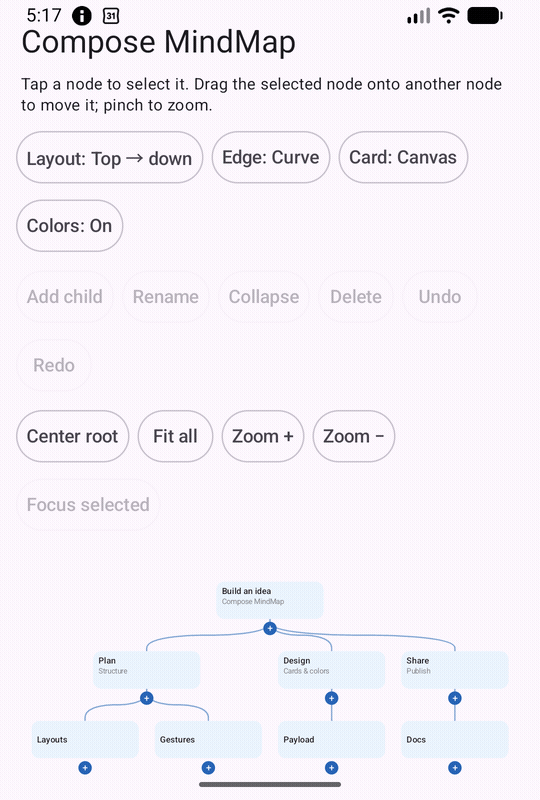

# Compose MindMap 사용 안내

Compose MindMap은 Android Jetpack Compose에서 트리형 마인드맵을 그리는 라이브러리입니다. 노드를 선택·이동·접고, 두 손가락으로 확대·이동할 수 있습니다. 샘플 앱에는 레이아웃, 간선, 카드 모양, 편집, 뷰포트 조작 버튼이 있습니다




## 설치

Android `minSdk 26`, Java 17, Jetpack Compose가 필요합니다. `0.2.0` 태그와 JitPack 빌드가 공개되면 아래 좌표를 사용할 수 있습니다. 그 전에는 저장소의 `sample` 모듈을 실행하세요

`settings.gradle.kts`의 `dependencyResolutionManagement.repositories`에 다음을 추가합니다

```kotlin
dependencyResolutionManagement {
    repositoriesMode.set(RepositoriesMode.FAIL_ON_PROJECT_REPOS)
    repositories {
        google()
        mavenCentral()
        maven("https://jitpack.io")
    }
}
```

앱 모듈의 `build.gradle.kts`에는 다음을 추가합니다

```kotlin
dependencies {
    implementation("com.github.UiHyeon-Kim:compose-mindmap:0.2.0")
}
```

## 첫 화면

```kotlin
@Composable
fun MyMindMap() {
    val nodes = listOf(
        MindMapNode(id = "root", title = "내 아이디어"),
        MindMapNode(id = "first", title = "첫 번째 가지", parentId = "root"),
    )
    MindMapCanvas(nodes = nodes, modifier = Modifier.fillMaxSize())
}
```

`MindMapCanvas`와 `MindMapNode`는 각각 `io.github.hanhyo.composemindmap.canvas`, `io.github.hanhyo.composemindmap.model` 패키지에 있습니다. 모든 노드는 고유 ID를 가져야 하고 루트는 하나여야 합니다

## 원하는 모습과 동작으로 바꾸기

- `MindMapStyle`로 기본 카드·간선 색상과 크기·간격을 바꾸고, `MindMapNode.color`로 노드별 색상을 지정합니다
- `nodeContent`에는 원하는 Compose 카드를 넣습니다. 카드의 실제 크기가 다르면 `nodeSize`도 함께 지정해야 배치와 터치 판정이 맞습니다
- `PayloadMindMapCanvas`와 `withPayload`를 쓰면 노드별 도메인 데이터를 타입을 유지한 채 카드에 전달할 수 있습니다
- `layoutEngine`으로 위에서 아래/왼쪽에서 오른쪽 배치를, `edgeRenderer`로 곡선/직선/직각 간선을 선택합니다
- `MindMapBehavior`로 확대·이동 가능 여부, 확대 범위, 초기 화면 배치를 지정합니다
- 접근성 설명은 `semanticLabelProvider = MindMapSemanticLabelProvider { node, visual -> … }`로, 동작 이름은 `accessibilityActionLabels`로 바꿀 수 있습니다. `visual`에는 선택·접힘 상태가 들어 있습니다

완전한 코드는 [샘플 액티비티](../sample/src/main/java/io/github/hanhyo/composemindmap/sample/SampleActivity.kt)를 참고하세요

## 편집과 화면 복원

노드 목록은 앱이 소유합니다. `MindMapEditController`의 `addNode`, `updateNode`, `deleteNode`, `moveNode`, `undo`, `redo`로 새 목록을 만든 뒤 다시 `MindMapCanvas`에 전달합니다. `editMode = true`를 켜야 자식 추가 버튼과 노드 이동을 사용할 수 있습니다. 이동할 노드를 먼저 선택한 다음 다른 노드로 드래그합니다. 자기 자신 또는 자신의 하위 노드로 이동하는 동작은 거부됩니다

접힌 노드 ID 집합은 `collapsedNodeIds`에 전달합니다. 화면 확대율과 위치를 재생성 후 복원하려면 `rememberSaveableMindMapCanvasState()`를 사용합니다. 노드 데이터와 편집 이력은 앱에서 별도 저장해야 합니다

`state.centerRoot()`, `state.fitContent()`, `state.zoomBy(1.4f)`, `state.focusNode(id, padding = 32.dp)`로 원하는 위치에 화면을 맞출 수 있습니다. `focusNode`의 여백은 최소 확대율 제한이 허용하는 범위에서 적용됩니다

## 실행과 범위

Android Studio에서 `sample`을 실행하거나 `./gradlew :sample:installDebug`를 실행합니다. 단위 테스트·lint·릴리스 AAR·샘플 빌드 명령은 [영문 README](../README.md#run-the-sample-and-tests)에 있습니다

현재 Android 전용 단일 루트 트리를 지원합니다. 방사형·양방향 배치, 교차 간선, 내보내기, Compose Multiplatform, 대형 트리 성능 최적화는 후속 과제입니다. 사용 전 [0.2.0 마이그레이션 안내](MIGRATION-0.2.0.md)도 확인하세요
